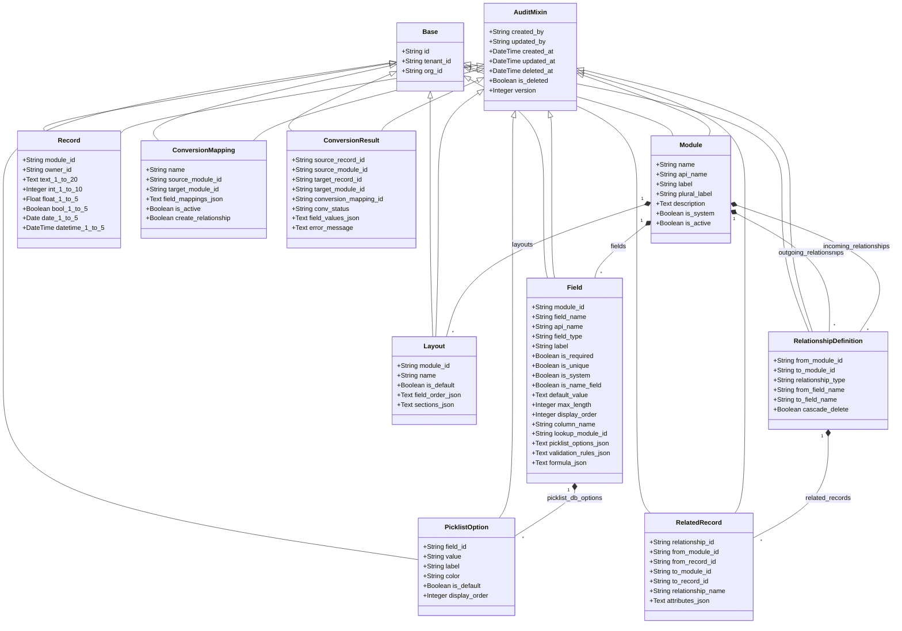

# CRUD Engine Schema UML

This artifact contains the UML Class Diagram for the CRUD Engine ORM Schema, including its entities and their relationships.

```mermaid
classDiagram
    class Base {
        +String id
        +String tenant_id
        +String org_id
    }
    
    class AuditMixin {
        +String created_by
        +String updated_by
        +DateTime created_at
        +DateTime updated_at
        +DateTime deleted_at
        +Boolean is_deleted
        +Integer version
    }
    
    class Module {
        +String name
        +String api_name
        +String label
        +String plural_label
        +Text description
        +Boolean is_system
        +Boolean is_active
    }
    
    class Field {
        +String module_id
        +String field_name
        +String api_name
        +String field_type
        +String label
        +Boolean is_required
        +Boolean is_unique
        +Boolean is_system
        +Boolean is_name_field
        +Text default_value
        +Integer max_length
        +Integer display_order
        +String column_name
        +String lookup_module_id
        +Text picklist_options_json
        +Text validation_rules_json
        +Text formula_json
    }
    
    class PicklistOption {
        +String field_id
        +String value
        +String label
        +String color
        +Boolean is_default
        +Integer display_order
    }
    
    class Layout {
        +String module_id
        +String name
        +Boolean is_default
        +Text field_order_json
        +Text sections_json
    }
    
    class Record {
        +String module_id
        +String owner_id
        +Text text_1_to_20
        +Integer int_1_to_10
        +Float float_1_to_5
        +Boolean bool_1_to_5
        +Date date_1_to_5
        +DateTime datetime_1_to_5
    }
    
    class RelationshipDefinition {
        +String from_module_id
        +String to_module_id
        +String relationship_type
        +String from_field_name
        +String to_field_name
        +Boolean cascade_delete
    }
    
    class RelatedRecord {
        +String relationship_id
        +String from_module_id
        +String from_record_id
        +String to_module_id
        +String to_record_id
        +String relationship_name
        +Text attributes_json
    }
    
    class ConversionMapping {
        +String name
        +String source_module_id
        +String target_module_id
        +Text field_mappings_json
        +Boolean is_active
        +Boolean create_relationship
    }
    
    class ConversionResult {
        +String source_record_id
        +String source_module_id
        +String target_record_id
        +String target_module_id
        +String conversion_mapping_id
        +String conv_status
        +Text field_values_json
        +Text error_message
    }
    
    Base <|-- Module
    AuditMixin <|-- Module
    Base <|-- Field
    AuditMixin <|-- Field
    Base <|-- PicklistOption
    AuditMixin <|-- PicklistOption
    Base <|-- Layout
    AuditMixin <|-- Layout
    Base <|-- Record
    AuditMixin <|-- Record
    Base <|-- RelationshipDefinition
    AuditMixin <|-- RelationshipDefinition
    Base <|-- RelatedRecord
    AuditMixin <|-- RelatedRecord
    Base <|-- ConversionMapping
    AuditMixin <|-- ConversionMapping
    Base <|-- ConversionResult
    AuditMixin <|-- ConversionResult
    
    Module "1" *-- "*" Field : fields
    Module "1" *-- "*" Layout : layouts
    Module "1" *-- "*" RelationshipDefinition : outgoing_relationships
    Module "1" *-- "*" RelationshipDefinition : incoming_relationships
    Field "1" *-- "*" PicklistOption : picklist_db_options
    RelationshipDefinition "1" *-- "*" RelatedRecord : related_records
```
